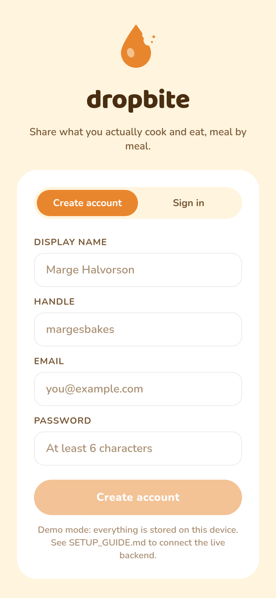
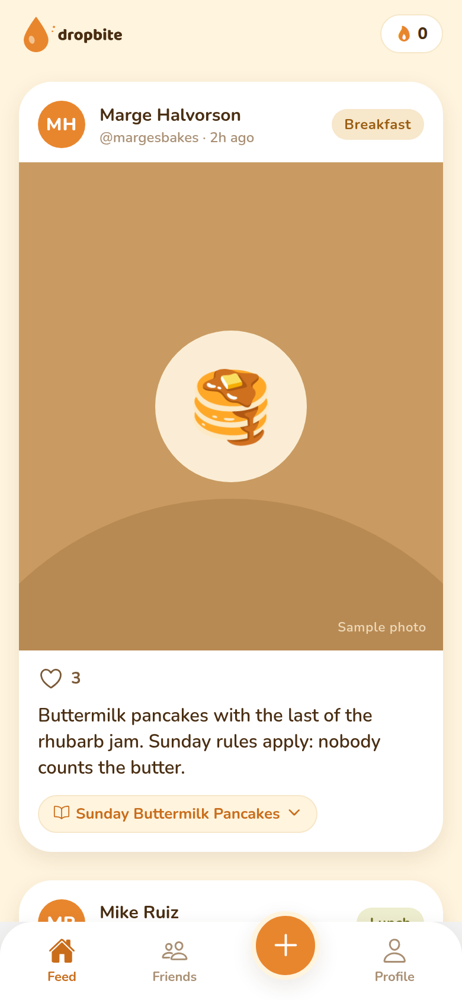
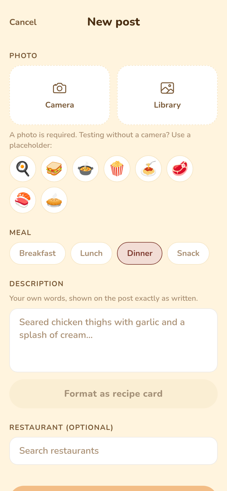
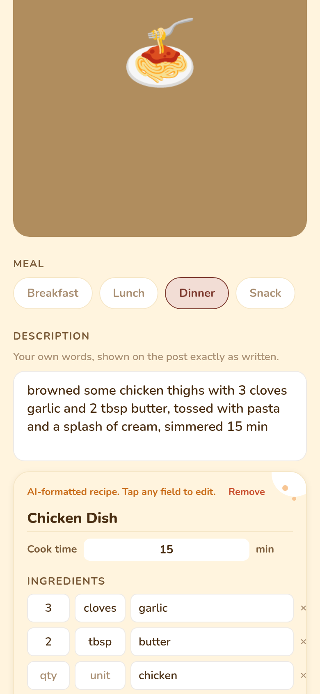
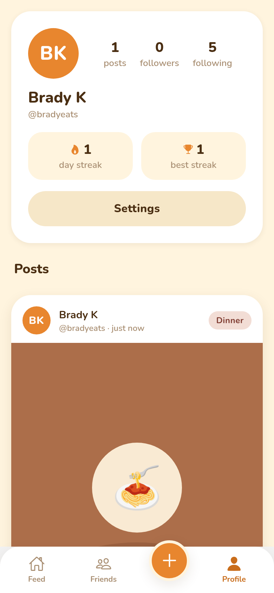
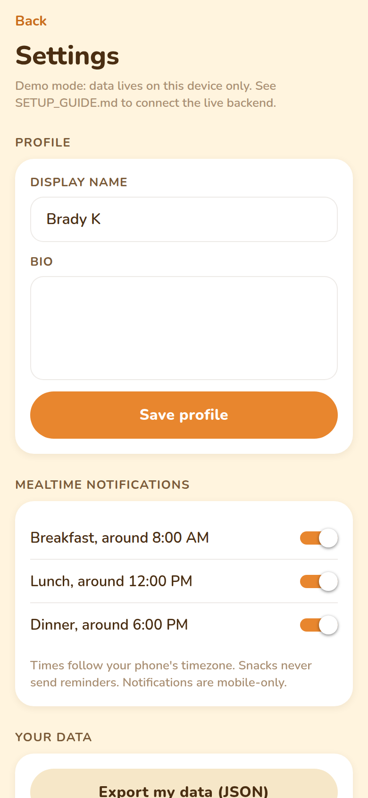

<p align="center">
  
</p>

# DropBite

A photo-first social app for sharing what you actually cook and eat, meal by meal.
BeReal energy, restructured around breakfast / lunch / dinner / snacks. Casual blurbs
become editable AI recipe cards; restaurant meals get tagged via Google Places.

Built with **React Native + Expo (TypeScript)**, **Supabase**, the **Anthropic API**,
and **Google Places**. See `PROJECT_SCOPE.md` for product vision and `CLAUDE.md` for
build conventions.

## It runs out of the box, no API keys needed

The app ships with a **demo mode**: when no Supabase env vars are set, everything runs
locally on-device (AsyncStorage) with a seeded feed of fake users and posts, a local
heuristic recipe formatter, and a built-in restaurant list. The full product loop
(sign up, follow, post, AI recipe card, streak) is testable immediately.

When you're ready to go live, plug in the real services: **[SETUP_GUIDE.md](SETUP_GUIDE.md)**
has the step-by-step for running it on your phone and wiring up Supabase, Anthropic,
Google Places, and push notifications.

## Quick start

```bash
npm install
npx expo start          # scan the QR code with Expo Go on your phone
npm run web             # or run in a browser
```

## Screens

| Welcome | Feed | Compose |
| --- | --- | --- |
|  |  |  |

| Editable AI recipe card | Profile & streaks | Settings |
| --- | --- | --- |
|  |  |  |

## What's in the MVP (Phase 1)

- Email auth + profiles (display name, handle, emoji avatar, bio)
- Follow system + chronological friends feed with pull-to-refresh
- Post flow: photo (required) → meal slot (smart default by time of day) → blurb →
  optional AI recipe card → optional restaurant tag
- AI recipe cleanup: blurb to structured `{title, ingredients[{item,quantity,unit}], steps[], cook_time}`,
  **every field editable before posting**, never blocks the post
- Restaurant tagging (Google Places Text Search in production, demo list offline)
- Likes (❤️ only for MVP)
- Streaks (current + longest, lapses after a missed day)
- Mealtime notifications (~8:00 / ~12:00 / ~18:00 local time, individually toggleable)
- Settings: profile edit, notification prefs, **data export (JSON)**, **account deletion**

Out of scope for MVP (per PROJECT_SCOPE.md): ads, payments, restaurant dashboards,
menu selection, nutrition, comments/DMs, feed algorithm.

## Project layout

```
App.tsx                     navigation + fonts + auth gate
src/
  config.ts                 env keys, DEMO_MODE flag, AI model/prompt config
  theme.ts                  brand palette, fonts, spacing (amber/cream/cocoa)
  types.ts                  User, Post, Recipe, Streak, …
  services/
    types.ts                DataService interface (one contract, two backends)
    mock/                   demo mode: AsyncStorage + seeded data
    supabase/               production: Supabase auth/db/storage
    ai.ts                   recipe formatting (edge function or local heuristic)
    places.ts               Google Places search (or demo list)
    notifications.ts        local scheduled mealtime notifications
  state/AppContext.tsx      session, feed, streak, prefs
  components/               PostCard, RecipeCardEditor, BittenCard, …
  screens/                  Auth, Feed, Compose, Friends, Profile, Settings
supabase/
  schema.sql                full Postgres schema + RLS + storage policies
  functions/format-recipe   Anthropic call (key stays server-side)
  functions/delete-account  account deletion (service-role, server-side)
```

## Brand

Amber `#E8862E` · Cream `#FFF4DE` · Cocoa `#4A2E12` · Baloo 2 ExtraBold wordmark ·
bitten-drop mark with crumb details (recipe cards carry the bitten-corner motif).
